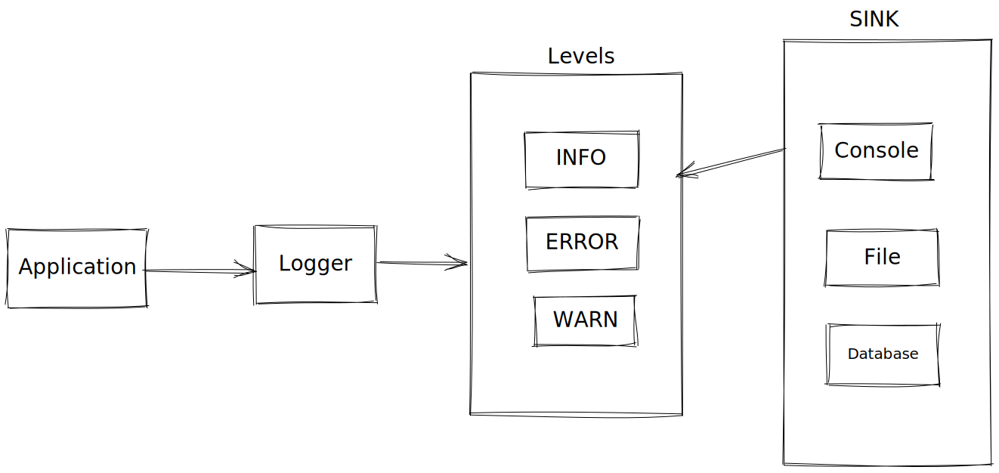

## Requirements

- should be able to log into more than one place like console,file,database and others
- should be able to log into multiple categories of message like **info**,**debug**,**error** and others
- category and place of logging should be configurable

### Component Involved

- Logger - which will be exposed to the application
- Category which will be selected at run time bases on some parameter
- Sink - this should be selected at runtime based on some parameter

